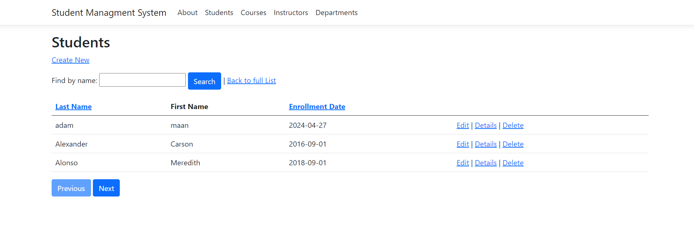

# Introduction
Welcome to our Warehouse Inventory Management System (WHMS), a cutting-edge solution meticulously designed to revolutionize your inventory operations. Powered by ASP.NET Core 8.0 Razor Pages (C#), WHMS offers a comprehensive suite of features including Sales, Purchase, Delivery, Goods Receive, Transfer, Adjustment, Return, Scrapping, Stock Count, Transaction Report, Movement Report

# Technical Features
- ASP.NET Core 6.0 Razor Pages (C#)
- EF Core / LINQ
- (Server side: paging, filter, search, sort)
- Clean Architecture
- Repository Pattern
- NumberSequence
- LogAnalyticMiddleWare
- CusTomMiddleWare implementation

# Functional Features
- About 
- Student 
- Courses
- Instructor 
- Departments 

# Live Demo Link
- Url: 

# Starred
Help us grow by give a star.

# Supporter
This project supported by: StockMaster [https://github.com/Tanveer255](https://github.com/Tanveer255). Feel free to visit their site and use 50% discount using discount code: **GITHUB50**